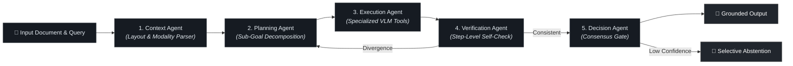

<h1 align="center">Hi, I'm Ehtesum-Ul-Islam</h1>
<h3 align="center">Software Engineer &amp; AI Systems Researcher</h3>

  <a href="https://ehtesum.github.io/portfolio_web/"><strong>Personal Website &amp; CV ↗</strong></a> &nbsp;•&nbsp;
  <a href="https://linkedin.com/in/ehtesum-ul-islam-01274a166/">LinkedIn</a> &nbsp;•&nbsp;
  <a href="mailto:ehtesumulislam@gmail.com">Email</a>

  

---

### 👨‍💻 About Me

- 🎓 **M.Sc. in Software Engineering & Digital Transformation** from **LUT University, Finland** (Completed Dec 2025)
- 🎓 **B.Sc. in Computer Science & Engineering** from **North South University, Bangladesh** (2021)
- 💼 **2+ years of professional engineering experience** building scalable backend systems, managing Azure cloud infrastructure, and automating CI/CD pipelines
- 🧠 **Research Focus:** Reliable AI systems, multi-agent multimodal reasoning, runtime model orchestration, process verification, and selective abstention to eliminate hallucinations

  
  &nbsp;
  

---

### 🔬 Featured Research & Open-Source Projects

- **[MACT_multimodel](https://github.com/ehtesum/MACT_multimodel):** Multi-agent architecture for multimodal visual document understanding (5-agent coordinated pipeline: Context, Planning, Execution, Verification, Decision) featuring decoupled process verification and test-time compute.
- **[seal_with_kg_no_hallucination](https://github.com/ehtesum/seal_with_kg_no_hallucination):** Neural-symbolic dialogue architecture integrating Selective Abstention Learning (SEAL) with dynamic RDF knowledge graphs to prevent hallucinations.
- **[seal_multi_agent](https://github.com/ehtesum/seal_multi_agent):** Multi-agent framework with knowledge-graph reasoning and benchmark evaluation pipelines.
- **[offline_latex_compiler](https://github.com/ehtesum/offline_latex_compiler):** Self-hosted browser LaTeX IDE running entirely locally with live PDF rendering.
- **[DubStream](https://github.com/ehtesum/DubStream):** High-throughput media and audio streaming pipeline for synchronised multilingual dubbing.
- **[order_forecast_from_history](https://github.com/ehtesum/order_forecast_from_history):** Time-series demand forecasting ML pipeline with rolling feature engineering.

#### 📐 MACT 5-Stage Orchestration Architecture

---

### 📄 Publications & Research

#### Peer-Reviewed Conference Paper
- **"Low-Cost Heart Rate Sensor and Mental Stress Detection Using Machine Learning"**  
  *5th International Conference on Trends in Electronics and Informatics (ICOEI 2021)*  
  IEEE Xplore • [DOI: 10.1109/ICOEI51242.2021.9452873](https://doi.org/10.1109/ICOEI51242.2021.9452873)

#### Manuscripts & Preprints
- **"Grounded Sequential Decision Processes with Decoupled Process Verification and Adaptive Test-Time Compute for Visual Document Reasoning"**  
  *Ehtesum-Ul-Islam (Manuscript in Preparation, 2026)*  
  Focus: Multi-agent coordination, decoupled step verification, adaptive compute scaling, and hallucination elimination in visual document understanding.
- **"Empirical Investigation of DevSecOps Practices, Automation, and Security Pipeline Integration in Cloud Infrastructure"**  
  *M.Sc. Research Thesis, LUT University (Dec 2025)*  
  Focus: Automated vulnerability scanning, CI/CD pipeline integration, container security, and infrastructure reliability across cloud environments.

---

### 🛠️ Technical Capabilities

- **AI & Systems:** Multi-Agent AI, Vision-Language Models (VLMs), Knowledge Graphs (RDF/Turtle), Selective Abstention, PyTorch, Transformers, QLoRA
- **Backend & APIs:** Python, FastAPI, Django, Flask, RESTful APIs, PostgreSQL, SQLite, MongoDB, RabbitMQ
- **Cloud & DevOps:** Microsoft Azure, Docker, Kubernetes, CI/CD (GitHub Actions, Bitbucket), Linux/Bash, NGINX
- **Languages:** Python (Advanced), JavaScript (ES6+), C++, Java, PHP

---

### 📜 Certifications

- **Docker & Kubernetes Masterclass: Build, Deploy & Scale on AWS, Azure & GCP** — *Udemy*
- **The Ultimate DevOps Bootcamp** — *Udemy*

---

### 📬 Connect With Me

- 🌐 **Portfolio & CV:** [ehtesum.github.io/portfolio_web](https://ehtesum.github.io/portfolio_web/)
- 💼 **LinkedIn:** [linkedin.com/in/ehtesum-ul-islam](https://linkedin.com/in/ehtesum-ul-islam-01274a166/)
- ✉️ **Email:** [ehtesumulislam@gmail.com](mailto:ehtesumulislam@gmail.com)
